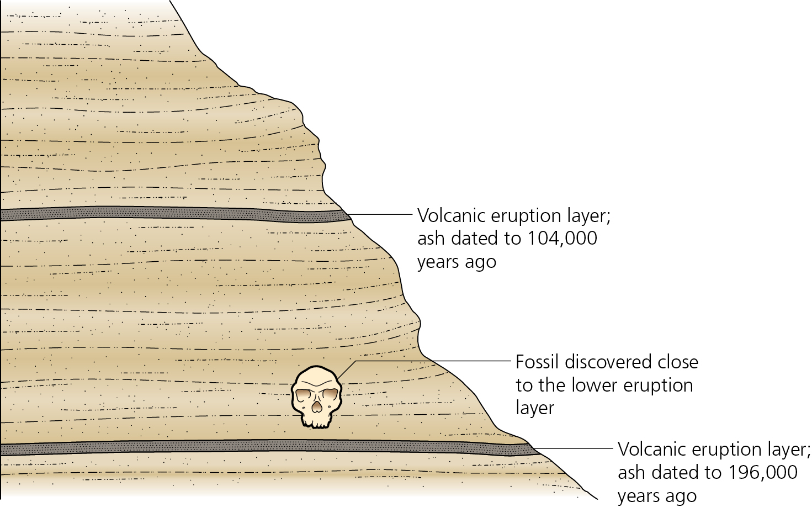

### Introruction

This narrative is adapted from material posted as online exercises by the [National Association of Geoscience Teachers](http://serc.carleton.edu/NAGTWorkshops/petrology/teaching_examples/calculating_rb-sr_isochrons.html) and supplements the material in Box 3.1 of Zimmer and Emlen (pp 57-59).  The basic problem we want to adress is that illustrated in figure 3.5 (pg. 61) Below



We've found a skull, positioned between two volcanic layers.  Those layers consist of a mixture of rocks and minerals, some of which are radioactive and decay with some predictable (and constant) half-life.  Thus, the amount of the radio isotope is determined by a) how much was in the mineral when the rock we formed and (b) how long it has been in place (i. e. how old is the rock).  As a hypothetical, suppose a sample initially contains 100 mg of Uranium 235, a radioactive element with a half life of 700 million years, and we could follow its progress over a billion years.  We would expect to see the following:

```{r,echo=FALSE}
t5 <-700*10^6
tm <-seq(100*10^7,0,-50000000)
u <-100*exp((-.693/t5)*tm)
plot(tm,u,xaxt="n",xlab="Time Before Present (MY)",ylab="Amount of U235",main="Hyothetical Decay of U235 with Time",col="darkred",pch=16)
axis(1,at=seq(0,10^9,2*10^8),labels=seq(0,100,20))
```
But of course, we don't have the luxury of being able to observe 100,000 years of decay as it occurs; rather what we need to do is to use a few replicated measures from the present to extapolate backwards in time and infer the age of the rock.

### The Basics of Isochrons

```{r}
dat <-read.csv("./Data/CalifGeo.csv")
str(dat)
```
```{r}
levels(dat$Site)

```
Try one; if it works, maybe do tapply
```{r}
par(mfrow=c(1,1))
mc <- dat[which(dat$Site=="Carmel Valley"),]
plot(mc[,5],mc[,6])
```

Try this"

```{r}
dat.spl <-split(dat,dat$Site)
```
OK.  Now we have four lists.  We should be able to lapply to get a plot
```{r}
par(mfrow=c(2,2))
lapply(dat.spl,function (x) plot(x[,5],x[,6],main=x$Site[1]))
```
Very nice.  Now we need to get the slopes and all of that, and do the conversion to age.  But enough for now/

Something like z=lm(y~x) followed by extracting z$coefficients[2].  Also need to plotx