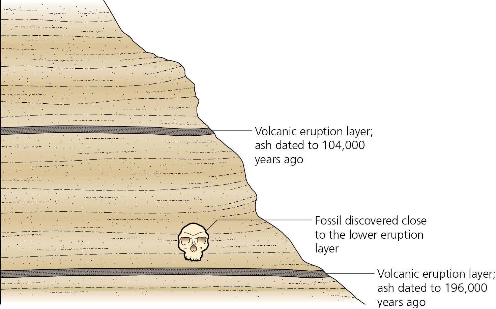

```{r,echo=FALSE,message=FALSE}
library(rmarkdown)
library(knitr)
```

### Introruction

This narrative is adapted from material posted as online exercises by the [National Association of Geoscience Teachers](http://serc.carleton.edu/NAGTWorkshops/petrology/teaching_examples/calculating_rb-sr_isochrons.html) and supplements the material in Box 3.1 of Zimmer and Emlen (pp 57-59).  The basic problem we want to adress is that illustrated in figure 3.5 (pg. 61) Below



We've found a skull, positioned between two volcanic layers.  Those layers consist of a mixture of rocks and minerals, some of which are radioactive and decay with some predictable (and constant) half-life.  Thus, the amount of the radio isotope is determined by a) how much was in the mineral when the rock we formed and (b) how long it has been in place (i. e. how old is the rock).  As a hypothetical, suppose a sample initially contains 100 mg of Uranium 235, a radioactive element with a half life of 700 million years, and we could follow its progress over a billion years.  We would expect to see the following:

```{r,echo=FALSE}
t5 <-700*10^6
tm <-seq(100*10^7,0,-50000000)
u <-100*exp((-.693/t5)*tm)
plot(tm,u,xaxt="n",xlab="Time Before Present (MY)",ylab="Amount of U235",main="Hyothetical Decay of U235 with Time",col="darkred",pch=16)
axis(1,at=seq(0,10^9,2*10^8),labels=seq(0,100,20))
```
But of course, we don't have the luxury of being able to observe 100,000 years of decay as it occurs; rather what we need to do is to use a few replicated measures from the present to extapolate backwards in time and infer the age of the rock. How can we do that, especially given that we don't know how much of the radioactive isotope was present in our samples to begin with?

### The Basics of Isochrons

The basic approach for doing so is described in Box 3.1 of Zimmer and Emlen (pg.  57).  The figure reproduced below is particularly important.


Look at the left panel first.  It illustrates the following:

1.  We have several samples of rocks from our site, all that crystallized at the same time.
2.  At the time of formation, the total ratio of ^87^Sr, the daughter product of the decay of ^87^Rb, and ^86^Sr, a stable isotope of Strontium, is the same in all samples.  The amount of radioactive ^87^Rb varies among samples.

Now look at the right panel.  As time progresses, ^87^Rb decays, so the amount of the daughter product of that decay, ^87^Sr, increases, so the ratio of the two Sr isotope increases.  Most importantly, **those samples that happened to have more Rb initially will produce more ^87^Sr, resulting in a higher ration of ^87^Sr to ^86^Sr (the amount of which remains constant over time).**
Thus, at a given time (and we won't work through the math, plotting the two ratios as shown results in a line, with a slope of  e^&lambda;t-1^, where &lambda; is the rate of decay per year, which in the case of ^87^Rb has been determined to be 1.42 X 10^-11^.  Thus, by determining the slope of the line and dividing  its natural logarithm by &lambda;, we can get an estimate of the age.

### An Example

But let's look at some real data.  These were obtained from four sites in California, three in the high Sierra (Yosemite region) and one from the coast range.  The locations are shown in the Google Earth image below:


So the first thing we will do is to plot the isochrons for each of the four sites:

```{r,echo=FALSE}
dat <-read.csv("./Data/CalifGeo.csv")
dat.spl <-split(dat,dat$Site)
par(mfrow=c(2,2))
rg.aln <-lapply(dat.spl,function (x){ plot(x[,5],x[,6],main=x$Site[1],xlab = "Rb87/Sr86",ylab="Sr87/Sr86")
  reg <-lm(x[,6]~x[,5])
  abline(reg,col="red")
    reg$coefficients[2]
  })
```
From these, we can not that the expected linear relationship is obtained in every case.  Thus, we can move forward and determine the slopes, and from them the ages of the samples.


```{r,echo=FALSE}
t.5 <-48.8*10^9 #half life
lmb <-log(2)/t.5 # convert to rate constant
age <-sapply(rg.aln, function (x) x/lmb)

age.n <-as.vector(age)
res <-data.frame(Site=names(dat.spl),Slope=unlist(rg.aln),Age=age.n)
kable(res,row.names=FALSE)
```

### For you to think about

Based on what we have determined regarding the physical age of these particular geological strata, what would you be able to conclude about any fossils you found associated with them.  In particular

1.  What geological era(s) would you expect them to be associated with?
2.  If you were interested in reconstructing past communities, and remembering that topography changes with time, could you hypothesize that species found in all four sites might have been members of the same community?  Why or why not? (**Hint** Remember that the calcluated ages have error associated with them; consider rounding them to the nearest 10 million years before answering the question.